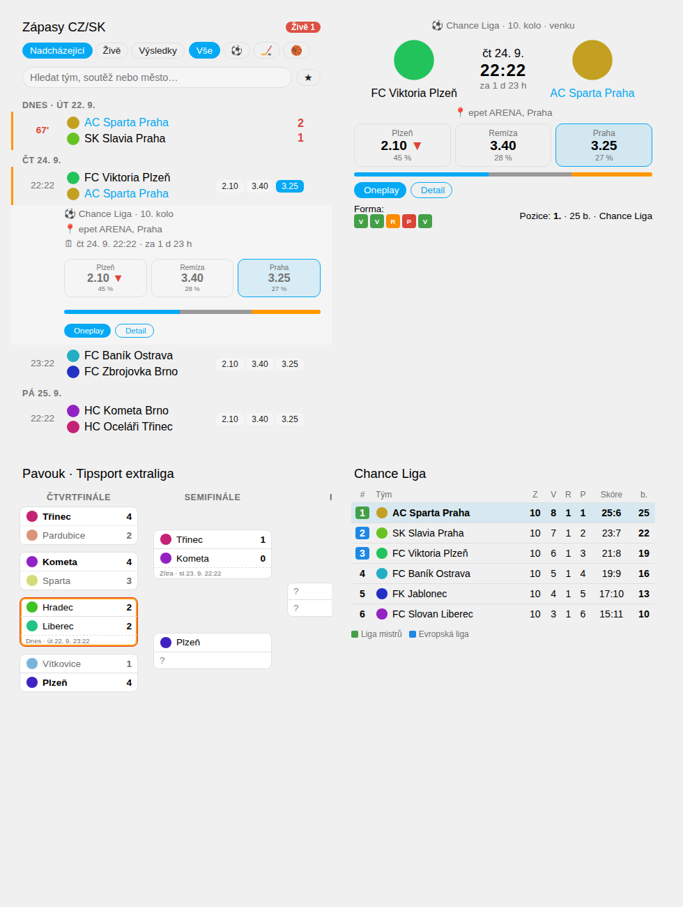

# HA Sport CZ/SK 🏒⚽🏀

Integrace pro Home Assistant na **fotbal, hokej a basketbal v Česku a na Slovensku**.
Ukazuje nadcházející zápasy, živé skóre, výsledky, tabulky, **pavouky play-off**, **kurzy**
a **kde se dá zápas sledovat** (TV / stream). Oblíbeným týmům posílá oznámení: připomenutí
před začátkem, góly, průběžné stavy a konečný výsledek.



## Co umí

| Oblast | Funkce |
|---|---|
| **Soutěže** | Automaticky najde všechny soutěže CZ/SK pro zvolené sporty (Chance Liga, Chance Národní liga, MOL Cup, Niké liga, Slovnaft Cup, Tipsport extraliga, Chance liga (hokej), Tipsport liga SK, Maxa/Kooperativa NBL, Tipos SBL, ženské a mládežnické soutěže…) |
| **Zápasy** | Nadcházející, živé (minuta / třetina / čtvrtina), výsledky, datum a čas, kolo, stadion a město |
| **Tabulky** | Pořadí, body, skóre, barevné označení postupových a sestupových míst, zvýraznění oblíbených týmů |
| **Pavouk** | Play-off / pohárový pavouk: stav série, vítěz, živé série, termín dalšího zápasu a kurz |
| **Kurzy** | 1 / X / 2 v desetinném formátu, pohyb kurzu (▲▼), pravděpodobnost výhry bez marže sázkovky |
| **Kde sledovat** | TV kanály ze zdroje dat a odkazy na streamy (Oneplay, ČT sport, Voyo, JOJ Šport / JOJ Play, STVR, TVCOM, Tipsport TV, Tipos TV…). Když zdroj kanál neuvádí, odhadne vysílatele podle práv dané soutěže (v kartě označeno `*`). |
| **Oblíbené týmy** | Každý má vlastní zařízení se senzory: příští zápas (s kurzem na váš tým), poslední výsledek, forma (V/R/P), pozice v tabulce, „právě hraje“, „hraje dnes“ |
| **Filtr** | Hledání podle názvu týmu, soutěže, **města** nebo stadionu (bez ohledu na diakritiku), podle sportu, jen oblíbené |
| **Oznámení** | X minut před začátkem (víc časů najednou, i vlastní), začátek zápasu, góly, konec poločasu/třetiny, průběžný stav každých N minut, konečný výsledek, tichý režim, push na mobil s tlačítkem **📺 Sledovat** |
| **Kalendáře** | `calendar.*_zapasy` a `calendar.*_zapasy_oblibenych` – fungují v kalendáři HA i v automatizacích |
| **Karty** | Zápasy s filtrem, můj tým, chytrá karta, pavouk, tabulka – s vizuálním editorem, načítají se automaticky |
| **Automatizace** | Události `ha_sport_notification` a `ha_sport_match_update`, služby vracející data (`get_matches`, `get_team`, `search_team`) |

## Instalace

### HACS (doporučeno)
1. HACS → Integrace → ⋮ → *Vlastní repozitáře* → přidejte `https://github.com/joshuaaaaa/HA-Sport`, kategorie **Integrace**.
2. Nainstalujte **HA Sport CZ/SK** a restartujte Home Assistant.

### Ručně
Zkopírujte složku `custom_components/ha_sport` do `config/custom_components/` a restartujte HA.

### Nastavení
*Nastavení → Zařízení a služby → Přidat integraci → HA Sport CZ/SK*

1. **Sporty a země**: fotbal / hokej / basketbal, Česko / Slovensko.
2. **Soutěže**: hlavní ligy a poháry jsou předvybrané.
3. **Oblíbené týmy**: vyberte ze seznamu týmů zvolených soutěží nebo vyhledejte jiný tým (např. reprezentaci „Česko“, klub z jiné soutěže).
4. **Oznámení**: kdy a kam je posílat.

Všechno jde později změnit přes **Konfigurovat** (soutěže, oblíbené týmy, oznámení, obecné).
Karty se zaregistrují samy, žádný zdroj (resource) do Lovelace přidávat nemusíte.

## Karty na nástěnku

Všechny karty najdete v nabídce „Přidat kartu“ (hledejte „HA Sport“) a mají vizuální editor.

### Zápasy s filtrem
```yaml
type: custom:ha-sport-card
mode: matches          # nadcházející / živě / výsledky + hledání + filtr podle sportu
title: Zápasy CZ/SK
# sport: ice-hockey     # jen jeden sport
# competition_id: 172   # jen jedna soutěž (ID je v atributu senzoru soutěže)
# city: Brno            # pevný filtr podle města
# favorites_only: true
# days: 14
```

### Můj tým – příští zápas s kurzem
```yaml
type: custom:ha-sport-team-card
# team_id: 2714   # bez team_id zobrazí všechny oblíbené týmy
days: 7
```
Ukazuje loga, datum a odpočet, kurzy 1/X/2 se zvýrazněním vašeho týmu a pravděpodobností,
tlačítko streamu, zvonek pro oznámení, formu, pozici v tabulce a další zápasy v týdnu.
Během zápasu zobrazuje živé skóre a minutu.

### Chytrá karta (kurz na můj tým, nebo pavouk)
```yaml
type: custom:ha-sport-smart-card
competition_id: 261   # soutěž, jejíž pavouk/tabulka se ukáže, když oblíbené týmy tento týden nehrají
days: 7
```
Když některý oblíbený tým hraje v příštích `days` dnech, ukáže zápas s kurzem. Jinak ukáže
pavouka vybrané soutěže (nebo tabulku, pokud soutěž pavouka nemá).

### Pavouk
```yaml
type: custom:ha-sport-bracket-card
competition_id: 261
```

### Tabulka
```yaml
type: custom:ha-sport-standings-card
competition_id: 172
max_rows: 10
short_names: true
```

## Entity

| Entita | Popis |
|---|---|
| `sensor.<soutez>` | Čas příštího zápasu soutěže. Atributy: `upcoming`, `results`, `live`, `standings`, `leader`, `has_bracket`, `competition_id` |
| `sensor.<tym>_pristi_zapas` | Čas příštího / probíhajícího zápasu. Atributy: `opponent`, `home_away`, `odds_team`, `odds_draw`, `odds_opponent`, `win_probability`, `tv`, `stream_url`, `score`, `minute`, `starts_in_minutes`, `this_week`, `form` |
| `sensor.<tym>_posledni_vysledek` | např. `Sparta 2:1 Slavia`, atribut `result` (výhra/remíza/prohra), `form` |
| `sensor.<tym>_pozice_v_tabulce` | pozice, body, skóre |
| `binary_sensor.<tym>_prave_hraje` | zapnuto během zápasu, atributy skóre a minuta |
| `binary_sensor.<tym>_hraje_dnes` | zapnuto, když tým dnes hraje |
| `binary_sensor.*_oblibeny_tym_hraje` | hraje kterýkoliv oblíbený tým |
| `sensor.*_zive_zapasy`, `sensor.*_dnesni_zapasy`, `sensor.*_zapasy_oblibenych_tento_tyden` | počty a seznamy zápasů |
| `calendar.*_zapasy`, `calendar.*_zapasy_oblibenych` | kalendáře zápasů (s kurzy a odkazy na stream v popisu) |
| `switch.*_oznameni`, `switch.*_ziva_oznameni` | rychlé vypnutí oznámení (např. na dovolené) |
| `button.*_obnovit_data`, `button.*_testovaci_oznameni` | |

## Oznámení

Nastavení → HA Sport → Konfigurovat → **Oznámení**:

* **Pro které zápasy**: oblíbené týmy + ručně sledované / jen ručně sledované / všechny zápasy vybraných soutěží.
  Jednotlivý zápas zapnete **zvonkem 🔔** v kartě nebo službou `ha_sport.follow_match`.
* **Upozornit před začátkem**: libovolná kombinace (5 min … 1 den), lze zadat i vlastní počet minut.
* **Začátek, góly, přestávky, konec**: každé zvlášť. U basketbalu se jednotlivé koše neoznamují.
* **Průběžný stav každých N minut**: 0 = vypnuto, jinak třeba každých 15 minut aktuální skóre.
* **Kam**: libovolné `notify.*` služby (mobilní aplikace dostane tlačítka *📺 Sledovat* a *Detail zápasu*, oznámení se stejným zápasem se nahrazují), nebo oznámení přímo v HA.
* **Tichý režim**: v nastaveném čase se nic neposílá.

Při živém zápasu se data obnovují automaticky rychleji (výchozí 60 s, od 20 minut před začátkem).

### Vlastní automatizace
Každé oznámení vyvolá událost `ha_sport_notification` (i v tichém režimu a když jsou oznámení vypnutá),
takže si můžete postavit vlastní reakce:

```yaml
automation:
  - alias: "Gól Sparty – bliknout světlem"
    trigger:
      - platform: event
        event_type: ha_sport_notification
        event_data:
          kind: score
    condition: "{{ 'Sparta' in trigger.event.data.home or 'Sparta' in trigger.event.data.away }}"
    action:
      - service: light.turn_on
        target: {entity_id: light.obyvak}
        data: {flash: long, color_name: red}

  - alias: "Zapnout TV 5 minut před zápasem"
    trigger:
      - platform: event
        event_type: ha_sport_notification
        event_data: {kind: pre_match, minutes: 5}
    action:
      - service: media_player.turn_on
        target: {entity_id: media_player.televize}
```

`kind` může být `pre_match`, `start`, `score`, `period`, `live_update`, `end`.
Každá změna skóre nebo stavu sledovaného zápasu vyvolá také `ha_sport_match_update`.

## Služby

| Služba | Popis |
|---|---|
| `ha_sport.get_matches` | vrátí zápasy podle filtru (`sport`, `competition_id`, `team_id`, `query`, `city`, `status`, `favorites_only`, `days_ahead`, `days_back`, `limit`) |
| `ha_sport.get_team` | příští a poslední zápas, forma, pozice |
| `ha_sport.search_team` | vyhledá tým (i reprezentaci) podle názvu nebo města |
| `ha_sport.add_favorite` / `remove_favorite` | správa oblíbených týmů |
| `ha_sport.follow_match` / `unfollow_match` / `mute_match` | oznámení pro konkrétní zápas |
| `ha_sport.refresh`, `ha_sport.test_notification` | |

Příklad (Vývojářské nástroje → Akce):
```yaml
action: ha_sport.get_matches
data:
  city: Brno
  status: upcoming
  days_ahead: 7
```

## Zdroj dat a upozornění

Data pochází z veřejného JSON API webu [Sofascore](https://www.sofascore.com) (neoficiální, bez API klíče).
Integrace požadavky omezuje: data ukládá do mezipaměti, kurzy stahuje jednou za 30 minut, tabulky a pavouky
jednou za hodinu a rychlé obnovování zapíná jen během zápasů. Pokud je API dočasně nedostupné, zkouší se záložní adresy
a zobrazí se poslední známá data. Adresu API lze změnit v nastavení.

Odkazy na streamy vedou na oficiální platformy držitelů vysílacích práv. Kurzy jsou jen informativní.

Informace o vysílacích právech v sezóně 2025/26–2026/27 (použité pro odhad, když zdroj kanál neuvádí):
* Chance Liga – Oneplay Sport ([chanceliga.cz](https://www.chanceliga.cz/clanek/18361-z-kanalu-o2-tv-sport-se-stavaji-stanice-oneplay-sport-kde-se-bude-vysilat-chance-liga), [o2.cz](https://www.o2.cz/osobni/oneplay/chance-liga))
* Tipsport extraliga – Oneplay Sport + ČT sport ([hokej.cz](https://www.hokej.cz/z-kanalu-o2-tv-sport-se-stavaji-stanice-oneplay-sport-kde-se-od-pondeli-bude-vysilat-tipsport-extraliga/5087318))
* Niké liga – Voyo + Dajto ([nikeliga.sk](https://www.nikeliga.sk/clanok/3333-aj-v-novej-sezone-vsetky-zapasy-nike-ligy-nazivo-na-voyo))
* Tipsport liga (SK hokej) – JOJ Šport, JOJ Play ([7sport.sk](https://7sport.sk/hokej/kde-sledovat-tipsport-liga-nazivo/))
* NBL – ČT sport, TVCOM, TV Chance ([7sport.cz](https://7sport.cz/basketbal/nbl-basketbal/))
* Tipos SBL – JOJ Šport, Tipos TV ([7sport.sk](https://7sport.sk/basketbal/sbl-basketbalova-extraliga-muzov/))

## Vývoj

```bash
pip install -r requirements_test.txt
pytest tests tests_ha
```
`tests/` testují čistou logiku bez HA, `tests_ha/` celou integraci (config flow, entity, WebSocket, služby, oznámení)
s mockovaným API.
